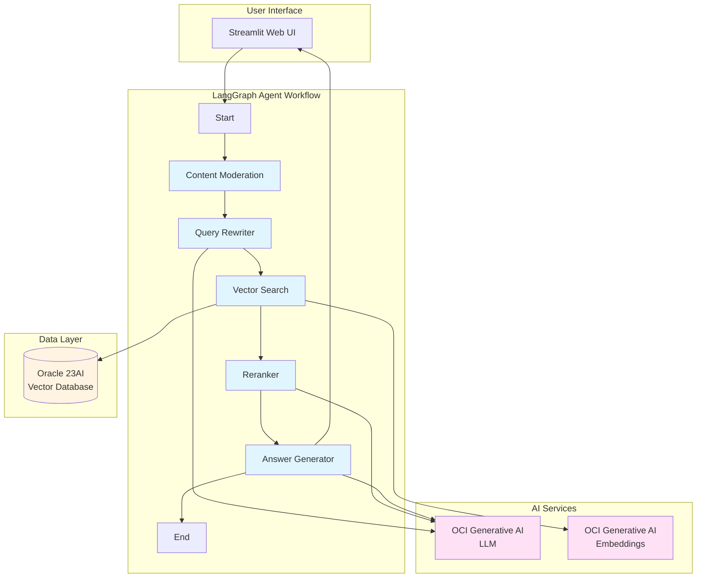
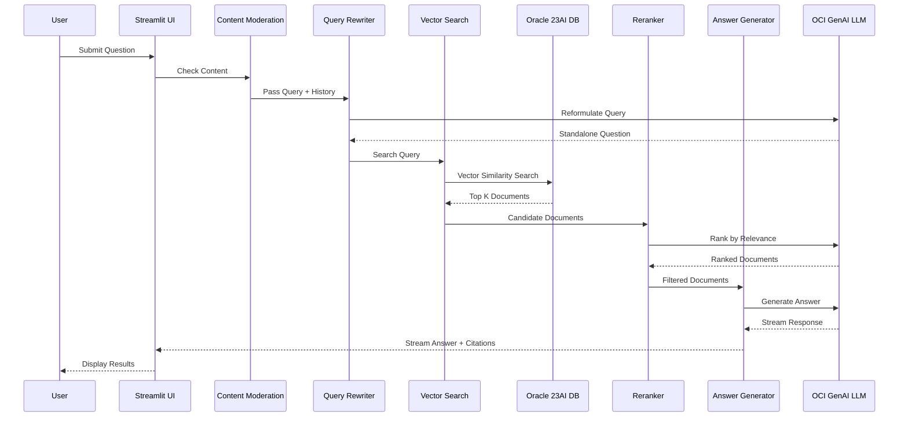

# Custom RAG Agent

A production-ready **Retrieval-Augmented Generation (RAG)** agent built with **LangGraph**, **Oracle 23AI Vector Store**, and **OCI Generative AI**. This agent implements an advanced multi-step workflow for intelligent document Q&A with streaming responses.

**Author**: L. Saetta  
**Reviewed**: 23.09.2025

## Overview

This application provides an intelligent question-answering system that:
- Processes user queries through a multi-stage pipeline
- Searches documents using semantic vector search
- Reranks results using LLM-based relevance scoring
- Generates contextual answers with citations
- Supports streaming responses and real-time UI updates

## Architecture



## Workflow



## Key Components

### 1. **Content Moderation** (`content_moderation.py`)
- Validates user input for inappropriate content
- First line of defense before processing

### 2. **Query Rewriter** (`query_rewriter.py`)
- Reformulates user queries using chat history
- Converts contextual questions into standalone queries
- Example: "What about that?" → "What is Oracle 23AI?"

### 3. **Semantic Search** (`vector_search.py`)
- Performs vector similarity search in Oracle 23AI
- Uses embedding model to find relevant document chunks
- Returns top K most similar documents

### 4. **Reranker** (`reranker.py`)
- Uses LLM to evaluate and rank retrieved documents
- Filters out irrelevant results
- Improves answer quality by focusing on best matches

### 5. **Answer Generator** (`answer_generator.py`)
- Generates final answer using retrieved context
- Includes citations to source documents
- Supports streaming for real-time responses

### 6. **State Management** (`agent_state.py`)
- Manages workflow state across all nodes
- Tracks: user request, chat history, documents, answers, errors

## Data Flow

```
User Query
    ↓
[Content Moderation] → Validates input
    ↓
[Query Rewriter] → Reformulates using history
    ↓
[Vector Search] → Finds similar documents
    ↓
[Reranker] → Filters & ranks documents
    ↓
[Answer Generator] → Creates final answer
    ↓
Streamlit UI → Displays answer + citations
```

## Technology Stack

- **Framework**: LangGraph (agent orchestration)
- **Vector Database**: Oracle 23AI with VECTOR data type
- **LLM**: OCI Generative AI (Meta Llama, Cohere, OpenAI models)
- **Embeddings**: OCI Generative AI (Cohere multilingual)
- **UI**: Streamlit
- **Observability**: OCI APM (optional, via py-zipkin)
- **Language**: Python 3.11

## Setup

### Prerequisites

1. **Oracle 23AI Database** with:
   - Vector Store enabled
   - Table: `DOCUMENT_CHUNKS_VS` (created automatically)
   - Wallet configured for secure connection

2. **OCI Account** with:
   - Generative AI service access
   - API keys configured in `~/.oci/config`
   - Compartment with Generative AI permissions

3. **Python 3.11**

### Installation

```bash
# Create virtual environment with uv
uv venv
source .venv/bin/activate

# Install dependencies
uv pip install -r requirements.txt
```

### Configuration

1. **Database Configuration** (`config_private.py`):
   ```python
   VECTOR_DB_USER = "your_user"
   VECTOR_DB_PWD = "your_password"
   VECTOR_DSN = "your_dsn"
   VECTOR_WALLET_DIR = "/path/to/wallet"
   VECTOR_WALLET_PWD = "wallet_password"
   ```

2. **OCI Configuration** (`config.py`):
   ```python
   OCI_PROFILE = "CHICAGO"  # Your OCI config profile
   COMPARTMENT_ID = "ocid1.compartment..."
   REGION = "us-chicago-1"
   ```

3. **Model Configuration** (`config.py`):
   ```python
   LLM_MODEL_ID = "meta.llama-3.3-70b-instruct"
   EMBED_MODEL_ID = "cohere.embed-multilingual-v3.0"
   COLLECTION_LIST = ["DOCUMENT_CHUNKS_VS"]
   ```

## Usage

### 1. Populate Knowledge Base

```bash
# Process PDF files
python scripts/populate_document_chunks_vs.py --files "document1.pdf" "document2.pdf"

# Process URLs
python scripts/populate_document_chunks_vs.py --urls "https://docs.oracle.com" "https://example.com"

# Process scraped data
python scripts/populate_document_chunks_vs.py --api-url "http://api-endpoint/v1/crawl/..."
```

### 2. Run the Application

```bash
streamlit run ui/assistant_ui_langgraph.py
```

The application will be available at `http://localhost:8501` (or next available port).

### 3. Query the Knowledge Base

1. Enter your question in the chat interface
2. The agent processes through all workflow stages
3. View intermediate results in the sidebar:
   - Standalone question (after rewriting)
   - References (after reranking)
4. Receive streaming answer with citations

## Features

### ✨ Streaming Responses
- Real-time answer generation
- Progressive UI updates as each stage completes
- Immediate display of document references

### 🔄 Chat History
- Maintains conversation context
- Automatically reformulates follow-up questions
- Configurable history length

### 🎯 Intelligent Reranking
- LLM-based relevance scoring
- Filters out irrelevant documents
- Improves answer accuracy

### 📊 Observability (Optional)
- OCI APM integration for tracing
- Performance monitoring
- Error tracking

### 🔒 Security
- Content moderation
- Wallet-based database authentication
- OCI IAM integration support

## Project Structure

```
custom-rag-agent/
├── src/
│   └── rag_agent/               # Core RAG agent package
│       ├── __init__.py
│       ├── agent_state.py       # State management
│       ├── rag_agent.py         # LangGraph workflow definition
│       ├── content_moderation.py # Content validation
│       ├── query_rewriter.py    # Query reformulation
│       ├── vector_search.py     # Semantic search
│       ├── reranker.py          # Document reranking
│       ├── answer_generator.py  # Answer generation
│       ├── prompts.py          # Prompt templates
│       ├── infrastructure/      # Infrastructure components
│       │   ├── __init__.py
│       │   ├── oci_models.py   # OCI GenAI integration
│       │   ├── db_utils.py     # Database utilities
│       │   ├── transport.py   # APM transport
│       │   ├── jwt_utils.py    # JWT utilities
│       │   ├── oci_jwt_client.py # OCI JWT client
│       │   └── custom_rest_embeddings.py # Custom embeddings
│       └── utils/              # Utility functions
│           ├── __init__.py
│           ├── utils.py        # General utilities
│           └── rag_feedback.py # Feedback handling
├── ui/                          # User interface
│   ├── __init__.py
│   ├── assistant_ui_langgraph.py # Streamlit UI
│   └── ui_mcp_agent.py         # MCP UI
├── api/                         # API endpoints
│   ├── __init__.py
│   └── rag_agent_api.py        # FastAPI REST API
├── scripts/                     # Utility scripts
│   ├── __init__.py
│   ├── populate_document_chunks_vs.py # Data ingestion
│   ├── chunk_index_utils.py    # Chunking utilities
│   ├── bm25_search.py          # BM25 search
│   ├── llm_with_mcp.py         # MCP integration
│   └── mcp_explorer.py         # MCP explorer
├── mcp_servers/                 # MCP server implementations
│   ├── __init__.py
│   ├── mcp_semantic_search.py  # Semantic search MCP
│   ├── mcp_semantic_search_stdio.py
│   ├── mcp_semantic_search_with_iam.py
│   ├── mcp_servers_config.py   # MCP server config
│   └── minimal_mcp_server.py   # Minimal MCP server
├── tests/                       # Test suite
│   ├── __init__.py
│   └── test_*.py                # Test files
├── docs/                        # Documentation
│   ├── README.md               # Main documentation
│   ├── DATABASE-SETUP.md       # Database setup
│   └── REQUIREMENTS-ANALYSIS.md # Requirements analysis
├── config.py                    # Application configuration
├── config_private.py           # Security credentials (gitignored)
├── config_private_template.py  # Config template
├── requirements.txt            # Dependencies
└── .gitignore                  # Git ignore rules
```

## Advantages of Agentic Approach

The modular LangGraph architecture provides:

1. **Flexibility**: Easy to add/remove/modify workflow steps
2. **Observability**: Each step can be monitored independently
3. **Error Handling**: Graceful degradation at each stage
4. **Extensibility**: Simple to add features like:
   - PII detection and anonymization
   - Multi-language support
   - Custom filtering logic
   - Additional validation steps

## Example Workflow Execution

```
User: "What is Oracle 23AI?"

1. [Moderator] ✓ Content validated
2. [QueryRewrite] → "What is Oracle 23AI?" (no history, no change)
3. [Search] → Found 6 relevant document chunks
4. [Rerank] → Ranked and filtered to top 3 chunks
5. [Answer] → Generated answer with citations:
   
   "Oracle 23AI is Oracle's next-generation database..."
   
   References:
   - DeepSeek.pdf (chunk 1)
   - Oracle Docs (page 5)
```

## Troubleshooting

See:
- `DATABASE-SETUP.md` - Database configuration
- `OCI-AUTH-SETUP.md` - OCI authentication
- `TROUBLESHOOTING-OCI-AUTH.md` - Common OCI errors

## License

MIT License

## References

- [LangGraph Documentation](https://langchain-ai.github.io/langgraph/)
- [Oracle 23AI Vector Search](https://docs.oracle.com/en/database/oracle/oracle-database/23/vecse/)
- [OCI Generative AI](https://docs.oracle.com/en-us/iaas/generative-ai/)
- [Integration with OCI APM](https://luigi-saetta.medium.com/enhancing-observability-in-rag-solutions-with-oracle-cloud-6f93b2675f40)
